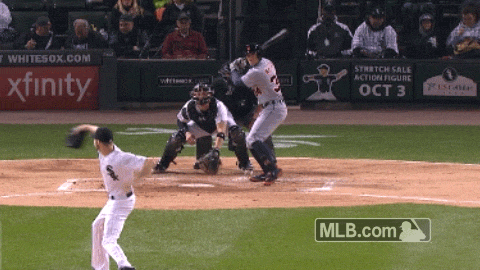

# Capstone Project

## Proposal

As injury prevention and rehabilitation remains an area for progress in athletics programs and professional sports organizations, there are reports that Major League Baseball (MLB) teams have, in recent years, begun to integrate their training and strength/conditioning operations with their baseball analytics departments, with the hope that they might, among other things, more reliably predict (and therefore avoid) player injuries.

In his 2017 book, *Smart Baseball*, Keith Law (then of ESPN) cites a team General Manager who said, "Having all of this data allows you to track player wellness better and hopefully cuts some potential injuries off at the pass. Even guys' running speed, when they're getting treatment for leg stuff, you see their speed drop down you know to give guys an off day. It might be some of the most low-hanging fruit out there, minimizing [Injured List] days, optimizing health and wellness."

Consider, for example, that roughly a quarter of major league pitchers used in 2017 had at some point in their lives undergone ulnar collateral ligament reconstruction (the procedure known as [Tommy John surgery](https://tht.fangraphs.com/ten-interesting-facts-about-tommy-john-surgery/#:~:text=In%20all%2C%2026%20percent%20of,had%20undergone%20Tommy%20John%20surgery.&text=In%202017%2C%20a%20whopping%2086.7,has%20had%20Tommy%20John%20surgery.)), from which it takes an average of 12–15 months to recover. Is it possible that, rather than living with an increased risk of seeing their most [valuable investments](https://www.cnbc.com/2019/12/11/gerrit-cole-agrees-to-historic-324-million-deal-with-yankees-reports.html#:~:text=Gerrit%20Cole%20agrees%20to%20historic%20%24324%20million%20deal%20with%20Yankees%2C%20reports%20say,-Published%20Wed%2C%20Dec&text=Gerrit%20Cole%2C%20the%20top%20free,largest%20deal%20in%20MLB%20history.) go under the knife, teams may be able to analyze certain newly-available, underlying pitch metrics (e.g., declining spin rates), as a proxy for fatigue? If it is shown that statistical trends related to pitch data—much of which is imperceptible to the eye—can help forecast injuries, teams may be empowered to offer proactive treatment and rest to pitchers before they begin to feel explicit pain or suffer structural damage.

Any example of one such lead can be seen here, in this visualization taken from the project notebook. Notice the direction in which Sale's release extension is trending as he moves toward the Injured List:

Of course, each pitcher's body is unique and will respond to stress differently. There is probably no "one-size-fits-all" solution to this problem, and therefore a significant sample of starting pitchers ought be studied. As for the scope of this current analysis, any conclusions found here should be limited to my particular case study—namely, seven-time All-Star Chris Sale of the Boston Red Sox—and may not necessarily apply to other pitchers.

With this relatively new information, it's plausible to think that, rather than waiting for a pitcher to get knocked around before warming up a reliever, such decisions can be made several pitches earlier if and when a dip in spin rate becomes apparent in the data. Or, rather than pushing a pitcher to the point of injury, that loss can be projected and avoided, or at least mitigated, after trends in the data emerge that might provide some advanced notice.

## Directory

### 1. "Data" folder, which in turns holds five CSV files:

* `sale_savant_data` — The data in its original form
* `sale_pitchfx` — A heavily modified and partially cleaned subset of `sale_savant_data` containing only observations from 2015–16
* `sale_statcast` — A heavily modified and partially cleaned subset of `sale_savant_data` containing only observations from 2017–19
* `sale_pitchfx_clean` — A fully cleaned version of `sale_pitchfx`
* `sale_statcast_clean`— A fully cleaned version of `sale_statcast`

### 2. "IMG" folder

This holds three images (including one gif) that are seen in the notebook.

* `100215_cws_sale_eephus.gif` — GIF of Eephus pitch that was discovered in the data
* `intentionalball.jpg` — Photo of an intentional ball
* `savant_search_terms.png` — Snapshot of the [Baseball Savant Search Page](https://baseballsavant.mlb.com/statcast_search)
* `fastball_ext_roll_mean_2018.png` — Sample visualization from the project notebook (`capstone_notebook.ipynb`)

### 3. "Video" folder

The video folder contains nine mp4 files, each of which shows an individual pitch from Sale's career deemed to be a statistical outlier. Videos were retrieved for exploratory purposes from the [MLB Advanced Video Search Library](https://www.mlb.com/video/search).

### 4. "Columns" file

Column names and descriptions of every feature in the original dataset (`sale_savant_data`).

### 5. "Custom Functions" file

Python file containing a handful of functions written for the project. Includes functions for counting the pitch number per game, and another for tracking the number of rest days between each one of Sale's starts.

### 6. "Future work" file

Text file offering ideas and paths forward for future work related to the project.

## Blog post

Visit [here](https://medium.com/@timsennett/predicting-mlb-pitch-classes-8c8163cd6c41) to read a blog post on a topic related to this project.

## Support

Reach out to me on [LinkedIn](https://www.linkedin.com/in/timsennett/) for further support, or any feedback worth sharing.