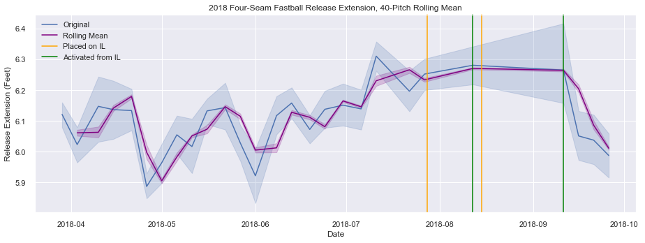
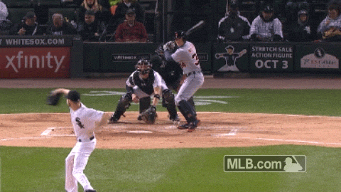

# Major League Baseball Pitcher Injuries

## Proposal

As injury prevention and rehabilitation remains an area for progress in athletics programs and professional sports organizations, there are reports that Major League Baseball (MLB) teams have, in recent years, begun to integrate their training and strength/conditioning operations with their baseball analytics departments, with the hope that they might, among other things, more reliably predict (and therefore avoid) player injuries.

In his 2017 book, *Smart Baseball*, Keith Law (then of ESPN) cites a team General Manager who said, "Having all of this data allows you to track player wellness better and hopefully cuts some potential injuries off at the pass. Even guys' running speed, when they're getting treatment for leg stuff, you see their speed drop down you know to give guys an off day. It might be some of the most low-hanging fruit out there, minimizing [Injured List] days, optimizing health and wellness."

Consider, for example, that roughly a quarter of major league pitchers used in 2017 had at some point in their lives undergone ulnar collateral ligament reconstruction (the procedure known as [Tommy John surgery](https://tht.fangraphs.com/ten-interesting-facts-about-tommy-john-surgery/#:~:text=In%20all%2C%2026%20percent%20of,had%20undergone%20Tommy%20John%20surgery.&text=In%202017%2C%20a%20whopping%2086.7,has%20had%20Tommy%20John%20surgery.)), from which it takes an average of 12–15 months to recover. Is it possible that, rather than living with an increased risk of seeing their most [valuable investments](https://www.cnbc.com/2019/12/11/gerrit-cole-agrees-to-historic-324-million-deal-with-yankees-reports.html#:~:text=Gerrit%20Cole%20agrees%20to%20historic%20%24324%20million%20deal%20with%20Yankees%2C%20reports%20say,-Published%20Wed%2C%20Dec&text=Gerrit%20Cole%2C%20the%20top%20free,largest%20deal%20in%20MLB%20history.) go under the knife, teams may be able to analyze certain newly-available, underlying pitch metrics (e.g., declining spin rates), as a proxy for fatigue? If it is shown that statistical trends related to pitch data—much of which is imperceptible to the eye—can help forecast injuries, teams may be empowered to offer proactive treatment and rest to pitchers before they begin to feel explicit pain or suffer structural damage.

An example of one such lead can be seen here, in this visualization taken from the included project notebook. Notice the direction in which Boston Red Sox star Chris Sale's release extension is trending as he moves toward the Injured List:

Of course, each pitcher's body is unique and will respond to stress differently. There is probably no "one-size-fits-all" solution to this problem, and therefore a significant sample of starting pitchers ought be studied. As for the scope of this current analysis, any conclusions found here should be limited to my particular case study—namely, the aforementioned seven-time All-Star Chris Sale—and may not necessarily apply to other pitchers.

In his eight seasons as a starting pitcher in the major leagues—first with the Chicago White Sox, and then with Boston—Chris Sale has acquired something of a reputation for showing diminished results near seasons' end. In fact, in his career, Sale has been 38% worse in September/October than in March/April–August. (See tOPS+ by month in the chart below, where 100 represents average monthly performance.)

<table class="" id="" data-cols-to-freeze="2" tabindex="-1" cellpadding="3" cellspacing="0" border="0" style="width:100%;max-width:300px;">
   <colgroup><col><col><col><col><col><col><col><col><col><col><col><col><col><col><col><col><col><col><col><col><col><col><col><col><col><col><col><col></colgroup>
   <thead>
      <tr>
         <th scope="col" align="center">I</th>
         <th scope="col" align="left">Split</th>
         <th scope="col" align="center">G</th>
         <th scope="col" align="center">PA</th>
         <th scope="col" align="center">AB</th>
         <th scope="col" align="center">R</th>
         <th scope="col" align="center">H</th>
         <th scope="col" align="center">2B</th>
         <th scope="col" align="center">3B</th>
         <th scope="col" align="center">HR</th>
         <th scope="col" align="center">BB</th>
         <th scope="col" align="center">SO</th>
         <th scope="col" data-filter="1" data-name="Strikeouts / Base On Balls" align="center">SO/W</th>
         <th scope="col" data-filter="1" data-name="Batting Average" align="center">BA</th>
         <th scope="col" data-filter="1" data-name="On-Base%" align="center">OBP</th>
         <th scope="col" data-filter="1" data-name="Slugging %" align="center">SLG</th>
         <th scope="col" data-filter="1" data-name="On-Base Plus Slugging" align="center">OPS</th>
         <th scope="col" align="center">TB</th>
         <th scope="col" data-filter="1" data-name="Batting Average on Balls In Play" align="center">BAbip</th>
         <th scope="col" align="center">tOPS+</th>
      </tr>
   </thead>
   <tbody>
<tr><th scope="row" align="left"></th><td data-endpoint="/tools/split_stats.cgi?full=0&amp;params=month%7CApril%2FMarch%7Csalech01%7Cpitch%7CAB%7C" align="left">April/March</td><td align="right">49</td><td align="right">1036</td><td align="right">955</td><td align="right">99</td><td align="right">207</td><td align="right">44</td><td align="right">3</td><td align="right">27</td><td align="right">62</td><td align="right">278</td><td align="right">4.48</td><td align="right">.217</td><td align="right">.271</td><td align="right">.354</td><td align="right">.625</td><td align="right">338</td><td align="right">.275</td><td align="right">100</td></tr>
<tr><th scope="row" align="left"></th><td data-endpoint="/tools/split_stats.cgi?full=0&amp;params=month%7CMay%7Csalech01%7Cpitch%7CAB%7C" align="left">May</td><td align="right">51</td><td align="right">1096</td><td align="right">999</td><td align="right">91</td><td align="right">183</td><td align="right">40</td><td align="right">4</td><td align="right">24</td><td align="right">73</td><td align="right">364</td><td align="right">4.99</td><td align="right">.183</td><td align="right">.247</td><td align="right">.303</td><td align="right">.551</td><td align="right">303</td><td align="right">.257</td><td align="right">77</td></tr>
<tr><th scope="row" align="left"></th><td data-endpoint="/tools/split_stats.cgi?full=0&amp;params=month%7CJune%7Csalech01%7Cpitch%7CAB%7C" align="left">June</td><td align="right">55</td><td align="right">1270</td><td align="right">1177</td><td align="right">98</td><td align="right">245</td><td align="right">43</td><td align="right">2</td><td align="right">25</td><td align="right">63</td><td align="right">401</td><td align="right">6.37</td><td align="right">.208</td><td align="right">.256</td><td align="right">.312</td><td align="right">.568</td><td align="right">367</td><td align="right">.290</td><td align="right">83</td></tr>
<tr><th scope="row" align="left"></th><td data-endpoint="/tools/split_stats.cgi?full=0&amp;params=month%7CJuly%7Csalech01%7Cpitch%7CAB%7C" align="left">July</td><td align="right">44</td><td align="right">1024</td><td align="right">945</td><td align="right">82</td><td align="right">216</td><td align="right">47</td><td align="right">1</td><td align="right">23</td><td align="right">53</td><td align="right">309</td><td align="right">5.83</td><td align="right">.229</td><td align="right">.284</td><td align="right">.353</td><td align="right">.637</td><td align="right">334</td><td align="right">.314</td><td align="right">105</td></tr>
<tr><th scope="row" align="left"></th><td data-endpoint="/tools/split_stats.cgi?full=0&amp;params=month%7CAugust%7Csalech01%7Cpitch%7CAB%7C" align="left">August</td><td align="right">56</td><td align="right">1121</td><td align="right">1032</td><td align="right">111</td><td align="right">225</td><td align="right">44</td><td align="right">3</td><td align="right">34</td><td align="right">66</td><td align="right">367</td><td align="right">5.56</td><td align="right">.218</td><td align="right">.275</td><td align="right">.365</td><td align="right">.640</td><td align="right">377</td><td align="right">.302</td><td align="right">105</td></tr>
<tr><th scope="row" align="left"></th><td data-endpoint="/tools/split_stats.cgi?full=0&amp;params=month%7CSept%2FOct%7Csalech01%7Cpitch%7CAB%7C" align="left">Sept/Oct</td><td align="right">57</td><td align="right">997</td><td align="right">916</td><td align="right">109</td><td align="right">236</td><td align="right">36</td><td align="right">4</td><td align="right">39</td><td align="right">57</td><td align="right">288</td><td align="right">5.05</td><td align="right">.258</td><td align="right">.313</td><td align="right">.433</td><td align="right">.747</td><td align="right">397</td><td align="right">.332</td><td align="right">138</td></tr>
</tbody></table>
</tbody></table>
Provided by <a href="https://www.sports-reference.com/sharing.html?utm_source=direct&amp;utm_medium=Share&amp;utm_campaign=ShareTool">Baseball-Reference.com</a>: <a href="https://www.baseball-reference.com/players/split.fcgi?id=salech01&amp;t=p&amp;year=Career&amp;utm_source=direct&amp;utm_medium=Share&amp;utm_campaign=ShareTool#month">View Original Table</a> Generated 7/3/2020.

  

In addition to these late-season slides, Sale has been somewhat injury-prone, especially in the second half of his career. Since 2015, he's been placed on the Injured List (IL) on five occasions, resulting in 121 missed games, and has made [$10,207,891](https://www.spotrac.com/mlb/boston-red-sox/chris-sale-7278/injuries/) during his time spent on the IL alone. (Those numbers are set to climb this year, as Sale will miss the entire, albeit [shortened](https://www.npr.org/2020/06/24/882678448/major-league-baseball-comes-back-for-shorter-season-after-coronavirus-shutdown#:~:text=Live%20Sessions-,Major%20League%20Baseball%20Comes%20Back%20For%20Shorter%20Season%20After%20Coronavirus,training%20beginning%20on%20July%201.), 2020 season while he recovers from—you guessed it—Tommy John surgery.)

In 2015, MLB introduced [Statcast](https://www.mlb.com/news/statcast-primer-baseball-will-never-be-the-same/c-119234412), a tracking technology that gathers previously immeasurable information about virtually every type of event that transpires in a baseball game. It collects the data "using a series of high-resolution optical cameras along with radar equipment that has been installed in all 30 Major League ballparks. The technology precisely tracks the location and movements of the ball and every player on the field at any given time." As it relates to pitching, Statcast opens up a whole new ecosystem of information to be analyzed, offering metrics such as vertical release point, horizontal release point, release extension, velocity and acceleration (in three dimensions), release spin rate, and more.

For decades, pitcher fatigue (not to mention the injuries that can follow) was most likely to be detected by the on-field results of pitches. *Is the pitcher getting hit hard? Are his stats suffering? Is he wincing after each pitch, or grabbing his hamstring?* **My aim is to see if, at least in Chis Sale's case, fatigue and/or injury can be targeted in a manner independent from on-field results by tracking the granular data, offered by Statcast, associated with the movement of each pitch.** And I found a strong case that there may be certain metrics, that, when they reach certain levels, may offer a red-flag of injury on horizon.

With this relatively new information, it's plausible to think that, rather than waiting for a pitcher to get knocked around before warming up a reliever, such decisions can be made several pitches earlier if and when a dip in spin rate becomes apparent in the data. Or, rather than pushing a pitcher to the point of injury, that loss can be projected and avoided, or at least mitigated, after trends in the data emerge that might provide some advanced notice.

## Directory

### 1. "Data" folder, which in turns holds five CSV files:

* `sale_savant_data` — The data in its original form
* `sale_pitchfx` — A heavily modified and partially cleaned subset of `sale_savant_data` containing only observations from 2015–16
* `sale_statcast` — A heavily modified and partially cleaned subset of `sale_savant_data` containing only observations from 2017–19
* `sale_pitchfx_clean` — A fully cleaned version of `sale_pitchfx`
* `sale_statcast_clean`— A fully cleaned version of `sale_statcast`

### 2. "IMG" folder

This holds three images (including one gif) that are seen in the notebook.

* `100215_cws_sale_eephus.gif` — GIF of Eephus pitch that was discovered in the data
* `intentionalball.jpg` — Photo of an intentional ball
* `savant_search_terms.png` — Snapshot of the [Baseball Savant Search Page](https://baseballsavant.mlb.com/statcast_search)
* `fastball_ext_roll_mean_2018.png` — Sample visualization from the project notebook (`capstone_notebook.ipynb`)

### 3. "Video" folder

The video folder contains nine mp4 files, each of which shows an individual pitch from Sale's career deemed to be a statistical outlier. Videos were retrieved for exploratory purposes from the [MLB Advanced Video Search Library](https://www.mlb.com/video/search).

### 4. "Columns" file

Column names and descriptions of every feature in the original dataset (`sale_savant_data`).

### 5. "Custom Functions" file

Python file containing a handful of functions written for the project. Includes functions for counting the pitch number per game, and another for tracking the number of rest days between each one of Sale's starts.

### 6. "Future work" file

Text file offering ideas and paths forward for future work related to the project.

## Blog post

Visit [here](https://medium.com/@timsennett/predicting-mlb-pitch-classes-8c8163cd6c41) to read a blog post on a topic related to this project.

## Support

Reach out to me on [LinkedIn](https://www.linkedin.com/in/timsennett/) for further support, or any feedback worth sharing.
